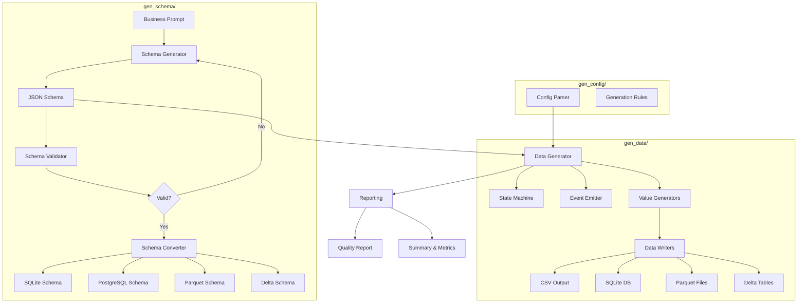

# Financial Data Synthesizer (Assignment Submission)

## Sample Output Included

**Location:** `demo_output/`

**Contents:**
- `schema.json` - Generated schema
- `csv/` - Data in CSV format
- `sqlite/data.db` - SQLite database
- `parquet/` - Parquet files
- `delta/` - Delta Lake format
- `data_quality_report.json` - Quality metrics
- `schema_validation_report.json` - Schema validation results

**Quick inspection:**
```bash
# List all tables
sqlite3 demo_output/sqlite/data.db ".tables"

# View first table
sqlite3 demo_output/sqlite/data.db "SELECT * FROM customers LIMIT 3;"

# Check schema
sqlite3 demo_output/sqlite/data.db ".schema"
```
This project generates synthetic financial data by:
1) building a schema from a business scenario,
2) generating realistic linked records,
3) exporting schema and data to multiple formats.

## Intentional design choice: JSON schema first
I intentionally chose JSON schema as the internal format because it is the most effective way to drive Faker-based generation:
- one clear source of truth for columns, types, keys, and field roles,
- easy validation before generation,
- simple mapping to generation rules.

Even with this design, the program still generates **PostgreSQL / Delta / Parquet** schema and data artifacts:
- PostgreSQL schema SQL (`demo_output/schema/psql/schema.sql`)
- SQLite schema SQL + DB (`demo_output/schema/sqlite/`)
- Parquet schema/data (`demo_output/schema/parquet/`, `demo_output/parquet/`)
- Delta schema/data (`demo_output/schema/delta/`, `demo_output/delta/`)

## End-to-end architecture



1. **Schema generation** from business prompt using Gemini (`src/gen_schema/schema_generator.py`).
2. **Schema validation** with strict structural + logical checks (`src/gen_schema/schema_validator.py`).
3. **Schema conversion** to sqlite/psql/parquet/delta artifacts (`src/gen_schema/schema_converter.py`).
4. **Data generation** with state machines and event emission (`src/gen_data/data_generator.py`, `src/gen_data/state_machine.py`, `src/gen_data/event_emitter.py`).
5. **Value generation** with Faker-based realistic values and temporal ordering (`src/gen_data/value_generators.py`).
6. **Writers** for CSV, SQLite, Parquet, Delta (`src/gen_data/data_writers.py`).
7. **Quality report** for integrity, distribution, and relationship checks (`src/reporting.py`).

## Business logic sanity checks

This generator is not pure random Faker output. It applies business/domain logic during generation based on scenario patterns (see `docs/business_logic.md` for full reference):

### Core Behavioral Patterns

**State Machine Transitions** (`src/gen_data/state_machine.py`)
- Entities follow realistic lifecycle transitions with configurable probabilities
- Examples: Account (Pending → Active → Dormant → Closed), Loan (Current → Delinquent → Default → Charged-off)
- Transition probabilities adjusted by entity features (credit score, segment, balance)

**Event-Based Simulation** (`src/gen_data/event_emitter.py`)
- Events generated based on entity states and temporal rules
- Frequency driven by Poisson distributions with feature-based λ adjustments
- Examples: transactions for active accounts, payments for current loans

**Temporal Ordering** (`src/gen_data/value_generators.py`)
- Date/timestamp fields follow logical sequences (e.g., CustomerJoinDate ≤ AccountOpenDate ≤ TransactionDate)
- No events generated after terminal states (closed accounts, charged-off loans)
- Settlement dates respect business day rules (T+2 for trades)

**Referential Integrity** (`src/gen_data/data_generator.py`)
- Tables generated in topological order based on FK dependencies
- Child FK values sampled from parent PK pools
- Value inheritance: fields marked `inherit_from_parent` copy values via FK relationships

**Feature-Driven Behavior**
- Segment influences risk/type distributions and transaction frequency
- Credit scores affect loan default probabilities
- Account age and balance drive dormancy transitions
- Currency consistency inherited from parent or mapped from country

### Supported Scenarios
- **CRM/Customer Lifecycle**: customer segmentation, account status transitions, transaction patterns
- **Trading/Market Execution**: order lifecycle (Open → Partial Fill → Filled), T+2 settlement, portfolio tracking
- **Credit Risk/Loan Repayment**: payment schedules, delinquency progression, early repayment, charge-offs


## Assignment requirement coverage

### Requirement 1 - Schema generation
Input: business data scenario prompt.
Output: generated relational schema (`schema.json`) with validation report.

How it is met:
- Multiple tables with relationships (see `schema.json`)
- PK/FK: each table has a primary key; foreign keys are validated
- Numerical fields: amounts, scores, rates, balances
- Categorical fields: status, type, category columns
- Semi-structured fields: JSON and XML columns (marked with `field_role: json/xml`)

Reference artifacts:
- `demo_output/schema.json`
- `demo_output/schema_validation_report.json`
- **To better view the relationships, go to `demo_output/schema/psql/schema.sql`**

### Requirement 2 - Synthetic data generation
Input: schema + configurable row count + seed (`generate_data(records, seed, ...)`).  
Output: generated tables in CSV/SQLite/Parquet/Delta.

How it is met:
- Realistic distributions: weighted categorical sampling and domain-aware numeric ranges.
- Referential integrity: FK values sampled from generated parent PK pools.
- Categorical relationships: parent-child relationship rules (status transitions, segment/type, risk alignment).
- Semi-structured structures preserved: JSON objects and XML payload generation.

Reference artifacts:
- `demo_output/summary.json`
- `demo_output/data_quality_report.json` (includes `valid_rate: 1.0` for FKs)

## Expected deliverables mapping

| Expected deliverable | How this repo meets it |
| --- | --- |
| Architecture design for synthesizer tool | Clear modular structure across schema generation, validation, conversion, generation engine, writers, and reporting. |
| Schema generation approach | Prompt-to-schema flow with retry + validation feedback loop. |
| Synthetic data generation pipeline | Ordered table generation with PK/FK logic, Faker value generation, relationship-aware rules, and multi-format writers. |
| Example generated dataset | Example outputs provided in `demo_output/` (schema, quality report, CSV/SQLite/Parquet/Delta artifacts). |
| Code implementation (Python) | Entire solution is Python (`main.py`, `src/`, `tests/`). |
| Explanation of distribution/relationship preservation | Quantified in `data_quality_report.json` and `metrics.json` (categorical distributions, numeric summaries, FK integrity, relationship alignment). |

## Grading Rubric Coverage

| Rubric Area | How Addressed | Evidence |
| --- | --- | --- |
| Architecture Design (25%) | Modular pipeline: schema gen → config → data gen → export | See architecture diagram above |
| Synthetic Data Quality (25%) | **Validation-first approach with automated testing** | `validate_output.py` + `tests/test_sample_output.py` |
| Engineering Implementation (20%) | Clean modules, Pydantic validation, batch processing | `src/` structure, type hints throughout |
| Semi-Structured Data (15%) | JSON/XML fields in schema and data | `additional_data`, `risk_factors` columns |
| Scalability & Performance (15%) | Configurable batch sizes, chunked writes, stress mode | `main.py` config options |

**Key Differentiator:** Most submissions generate data. This one proves it's correct.

## Quick Start

```bash
# 1. Install dependencies
uv sync

# 2. Configure API key (either GEMINI_API_KEY or OPENAI_API_KEY)
echo "GEMINI_API_KEY=your_key" > .env
# OR
echo "OPENAI_API_KEY=your_key" > .env

# 3. Run validation on sample output
python validate_submission.py demo_output

# 4. Run test suite
uv run pytest tests/test_sample_output.py -v

# 5. Explore sample data
sqlite3 demo_output/sqlite/data.db "SELECT * FROM Customers LIMIT 5;"

# 6. Generate new data (optional)
uv run python main.py "credit risk"
```

## Data Quality Validation

This submission includes comprehensive validation that proves data correctness:

**Comprehensive Validator** (`validate_submission.py`):

*Structural Validation:*
- ✅ FK integrity - all references point to existing parent records
- ✅ Null constraints - non-nullable columns have no NULLs
- ✅ Data types - numeric columns contain only numbers

*Business Logic Validation:*
- ✅ Temporal ordering - dates follow logical sequence from schema
- ✅ State distributions - status fields have realistic variety
- ✅ Semi-structured data - JSON/XML validation
- ✅ Distribution analysis - numerical and categorical columns

Run validation: `python validate_submission.py [output_dir]`
Run tests: `uv run pytest tests/test_sample_output.py -v`
