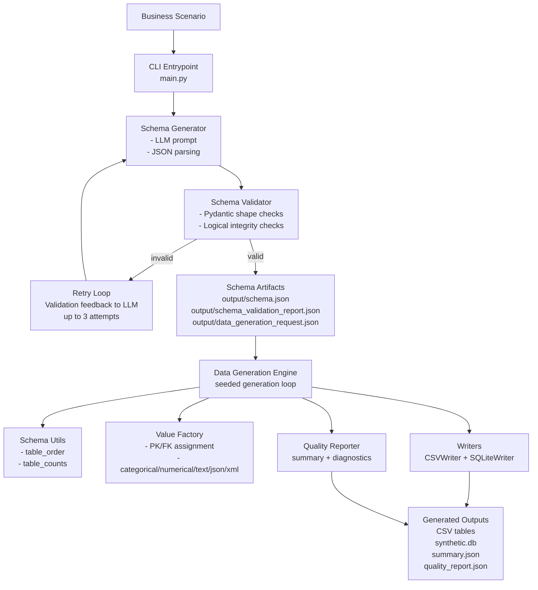

# Expected Deliverables Coverage

This document maps the assignment's "Expected Deliverables" to concrete code and artifacts in this repository.

## Deliverable Mapping

| Expected deliverable | How this repo fulfills it | Evidence |
| --- | --- | --- |
| Architecture design for the synthesizer tool | End-to-end CLI orchestrates schema generation, validation/retry, synthetic generation, and output writers through modular services. | `main.py`, `synthgen/schema_generator.py`, `synthgen/engine.py`, `synthgen/writers.py` |
| Schema generation approach | Scenario-driven LLM schema generation with strict Pydantic + logical validation and retry feedback loop. | `synthgen/schema_generator.py`, `synthgen/schema_models.py`, `synthgen/schema_validator.py`, `output/schema.json`, `output/schema_validation_report.json` |
| Synthetic data generation pipeline | Deterministic generation (seeded), parent-first table ordering, FK-aware row creation, CSV/SQLite output, and post-run quality report. | `synthgen/engine.py`, `synthgen/schema_utils.py`, `synthgen/values.py`, `synthgen/reporting.py`, `output/synthetic/` |
| Example generated dataset | Repository includes generated schema, request, multi-table CSVs, SQLite DB, and quality summaries. | `output/schema.json`, `output/data_generation_request.json`, `output/synthetic/*.csv`, `output/synthetic/synthetic.db`, `output/synthetic/summary.json`, `output/synthetic/quality_report.json` |
| Code implementation (Python preferred) | Entire implementation is Python with clear module boundaries and a single CLI entrypoint. | `main.py`, `synthgen/*.py`, `pyproject.toml` |
| Explanation of how distributions and relationships are preserved | Value generation uses weighted categorical rules, distribution-oriented numeric sampling, nullable policies, temporal anchoring, parent-profile inheritance, and FK integrity metrics. | `synthgen/values.py`, `synthgen/schema_utils.py`, `synthgen/reporting.py`, `output/synthetic/quality_report.json` |

## 1) Architecture Design for the Synthesizer Tool

## 2) Schema Generation Approach

1. Input is a natural-language business scenario (`main.py schema ...` or `main.py pipeline ...`).
2. `synthgen/schema_generator.py` sends a strict system prompt to Gemini requiring:
   - multiple tables,
   - PK/FK relationships,
   - numerical + categorical + semi-structured fields,
   - valid JSON output.
3. Raw model output is parsed and normalized.
4. `synthgen/schema_validator.py` validates both structure and logic:
   - schema shape via Pydantic (`synthgen/schema_models.py`),
   - duplicate tables/columns,
   - exactly one PK per table,
   - FK table/column existence,
   - required field-role coverage.
5. If invalid, structured validation issues are fed back into a retry prompt (up to 3 attempts).
6. On success, CLI writes:
   - canonical schema JSON,
   - schema validation report,
   - data-generation request JSON.

## 3) Synthetic Data Generation Pipeline

1. `main.py data ...` loads either a schema JSON or request JSON.
2. `synthgen/schema_utils.py` computes parent-first table order and per-table row counts.
3. `synthgen/engine.py` generates rows table-by-table with seeded randomness for reproducibility.
4. For each row:
   - PKs are generated deterministically by type,
   - FKs are sampled from already-generated parent PK pools,
   - non-key values are synthesized by column role/type via `synthgen/values.py`,
   - nullability policies are applied.
5. Output adapters persist rows to CSV and/or SQLite via `synthgen/writers.py`.
6. `synthgen/reporting.py` emits `summary.json` and `quality_report.json`.

## 4) Example Generated Dataset

An example run is already present under `output/synthetic/`:

- Tables: `customers.csv`, `portfolios.csv`, `instruments.csv`, `orders.csv`, `executions.csv`
- SQLite database: `synthetic.db`
- Run summary: `summary.json`
- Quality diagnostics: `quality_report.json`

Current sample summary (`output/synthetic/summary.json`):

- Customers: 10
- Instruments: 8
- Portfolios: 14
- Orders: 25
- Executions: 25

Semi-structured examples are visible in CSV outputs such as:

- `output/synthetic/customers.csv` (`address_details` JSON)
- `output/synthetic/orders.csv` (`order_details` JSON)

## 5) Code Implementation (Python)

Python implementation is split into focused modules:

- `main.py`: CLI orchestration for `schema`, `data`, `pipeline`
- `synthgen/schema_generator.py`: LLM schema generation + retry logic
- `synthgen/schema_models.py`: strict canonical schema models
- `synthgen/schema_validator.py`: schema quality/integrity checks
- `synthgen/engine.py`: core generation engine
- `synthgen/values.py`: distribution/value synthesis logic
- `synthgen/schema_utils.py`: dependency ordering and row-count heuristics
- `synthgen/writers.py`: CSV/SQLite persistence
- `synthgen/reporting.py`: quality and distribution reporting

Dependency evidence: `pyproject.toml` includes `faker`, `pydantic`, `google-genai`, and `python-dotenv`.

## 6) How Distributions and Relationships Are Preserved

### Referential integrity and relationships

- Parent tables are generated before child tables using FK dependency ordering (`table_order`).
- Child FK values are selected from real generated parent keys (`sample_parent_key`).
- Parent profiles are propagated to child generation context to preserve cross-table consistency (`profile_for_parent`, `_inherit_from_parent`).
- SQLite output enables FK constraints at runtime (`PRAGMA foreign_keys = ON`).
- Quality report explicitly tracks FK validity (`fk_integrity`) and reports invalid counts.

### Distribution realism

- Categorical columns use weighted options by semantic token (for example status, risk, currency, side).
- Numerical columns use role-aware sampling (Gaussian/lognormal patterns based on column semantics).
- Temporal fields are anchored to related timestamps where possible for plausible chronology.
- Nullable fields follow role-sensitive null rates (higher allowance for semi-structured/text-heavy fields).
- Semi-structured fields (JSON/XML) are populated with structured templates rather than flat placeholders.

### Observable evidence in sample outputs

- `output/synthetic/quality_report.json` shows FK `valid_rate` of `1.0` for all FK columns in the sample run.
- The same report captures categorical frequencies (for example `Customers.customer_status`, `Orders.side`) and numeric summaries (`min`, `max`, `avg`) per column.
